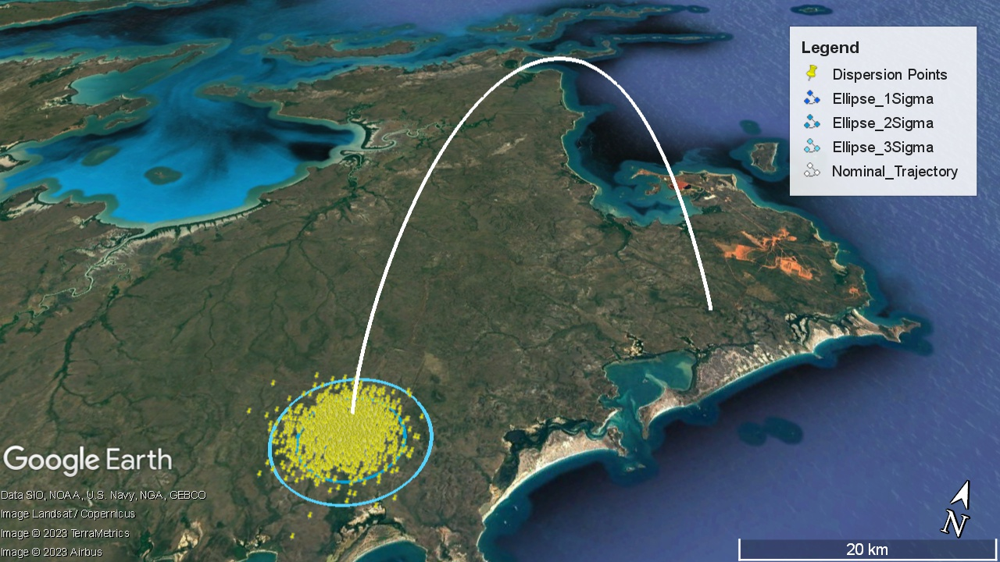

# 6DoF-Trajectory-Postprocessing

Trajectory postprocessing workflow requires the following 2 items:
1. Nominal trajectory in "LAT,LONG,ALT" form written into Nominal_Trajectory.csv
2. Dispersion point data in "LONG LAT <etc>" form from the ASTOS Monte-Carlo simulation written into MC_Results.txt

The output is given in the form of .kml data. PNG file for confidence ellipses are generated as well for validation.

 

